<!-- Los comentarios a lo largo del codigo son muy importantes nos ayudan  -->

<!DOCTYPE html>
<html>
<head>
<title>Moda</title>
<meta charset="UTF-8">
<meta name="viewport" content="width=device-width, initial-scale=1">
<link rel="stylesheet" href="https://www.w3schools.com/w3css/4/w3.css">
<link rel="stylesheet" href="https://fonts.googleapis.com/css?family=Oswald">
<link rel="stylesheet" href="https://fonts.googleapis.com/css?family=Open Sans">
<link rel="stylesheet" href="https://cdnjs.cloudflare.com/ajax/libs/font-awesome/4.7.0/css/font-awesome.min.css">

</head>

<body class="w3-light-grey">

<!-- Navigation bar with social media icons --> 

  <a href="#" class="w3-bar-item w3-button"><i class="fa fa-facebook-official"></i></a>
  <a href="#" class="w3-bar-item w3-button"><i class="fa fa-instagram"></i></a>
  <a href="#" class="w3-bar-item w3-button"><i class="fa fa-snapchat"></i></a>
  <a href="#" class="w3-bar-item w3-button"><i class="fa fa-flickr"></i></a>
  <a href="#" class="w3-bar-item w3-button"><i class="fa fa-twitter"></i></a>
  <a href="#" class="w3-bar-item w3-button"><i class="fa fa-linkedin"></i></a>
  <a href="#" class="w3-bar-item w3-button w3-right"><i class="fa fa-search"></i></a>

  
<!-- w3-content defines a container for fixed size centered content, 
and is wrapped around the whole page content, except for the footer in this example -->

  <!-- Header -->
  <header class="w3-container w3-center w3-padding-48 w3-white">
    <h1 class="w3-xxxlarge"><b>Moda  </b></h1>
    <h6>Bienvenidos a Moda para jóvenes </h6>
  </header>

  <!-- Image header -->
  <header id="home">
    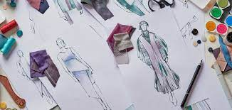
    

      <h1 class="w3-text-white">Y</h1>
      <h1 class="w3-jumbo w3-text-white w3-hide-small"><b>Moda para jóvenes </b></h1>
      <h6><button class="w3-button w3-white w3-padding-large w3-large w3-opacity w3-hover-opacity-off" onclick="document.getElementById('subscribe').style.display='block'">INCRESAR</button></h6>
    

  </header>

  <!-- Grid -->
  

    <!-- Blog entries -->
    

    
      <!-- Blog entry -->
      

        

          <h3>En este sitio web vamos hablar de los tipos de moda y de alguna manera para que puedas lucir hermos@ 

          </h5>
        

        

          
          
<strong>1 clásico</strong> algo de moda

          
 Apostar por el clásico siempre es un valor seguro, aunque para encontrar
             ese punto de sofisticación y glamour también hay que desarrollar criterio. ¡Es cuestión de práctica!

          
<button class="w3-button w3-white w3-border" onclick="likeFunction(this)"><b><i class="fa fa-thumbs-up"></i> Like</b></button>

          
<button class="w3-button w3-pink" onclick="myFunction('demo3')"><b>Replies  </b> 3</button>

          

          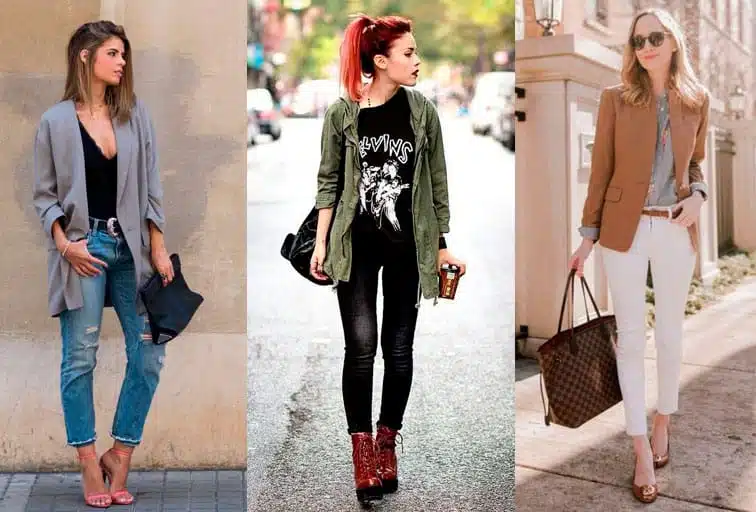
          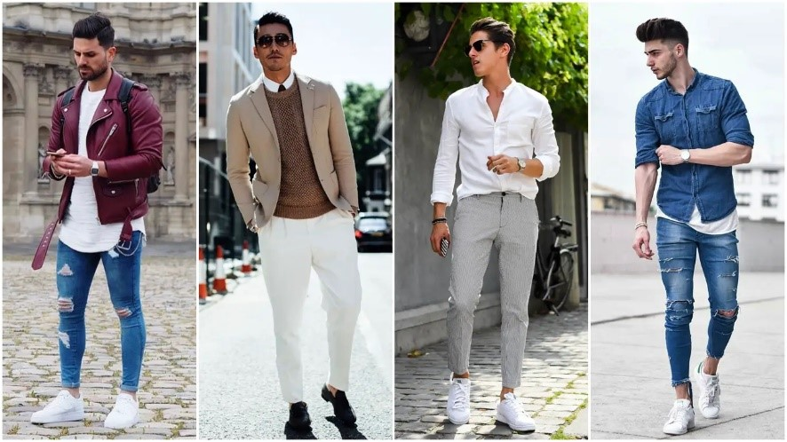

            

              
              
<strong>2. Romántico</strong> algo de moda

              
el estilo romántico es muy royal. Es el que elegirían las princesas Disney clásicas, pero con cuidado de no ir demasiado recargadas.
                 Y es que las prendas destacan por su alta ornamentación y por los cortes tridimensionales.

              
<button class="w3-button w3-white w3-border" onclick="likeFunction(this)"><b><i class="fa fa-thumbs-up"></i> Like</b></button>

              
<button class="w3-button w3-purple" onclick="myFunction('demo3')"><b>Replies  </b> 3</button>

              

              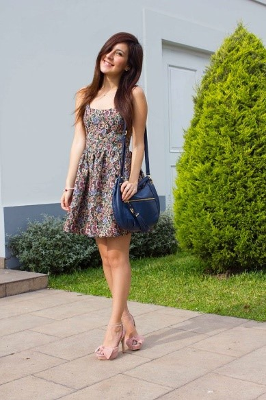
              
              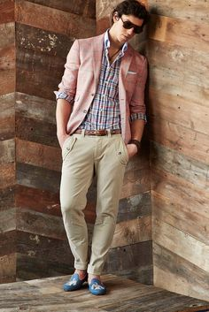

              

                
                
<strong>3. Boho  </strong> algo de moda

                
Entre los diferentes estilos de vestir, los inicios de este se suelen ubicar a principios del año 2000. Aúna lo hippy y lo bohemio, así que es un estilo con mucha personalidad que no resulta fácil clavar.
                   Lo bueno es que no tienes que imitarlo, sino adaptarlo a lo que te guste.

                
<button class="w3-button w3-white w3-border" onclick="likeFunction(this)"><b><i class="fa fa-thumbs-up"></i> Like</b></button>

                
<button class="w3-button w3-pink" onclick="myFunction('demo3')"><b>Replies  </b> 3</button>

                

                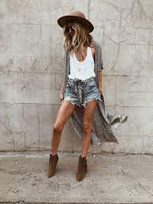
                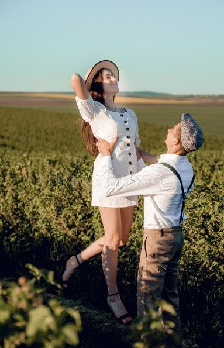

                  

                    
                    
<strong>4. Deportivo</strong> algo de moda

                    
Hace ya unos años que conocimos el concepto de athleisure , que promueve el uso de prendas deportivas en el día a día sin renunciar al glamour. Se puede ir chic con outfits tradicionalmente reservados al ejercicio físico, lo que tiene su dificultad.
                       Quienes lo consiguen trasladan mucha personalidad. 

                    
<button class="w3-button w3-white w3-border" onclick="likeFunction(this)"><b><i class="fa fa-thumbs-up"></i> Like</b></button>

                    
<button class="w3-button w3-purple" onclick="myFunction('demo3')"><b>Replies  </b> 3</button>

                    

      
                    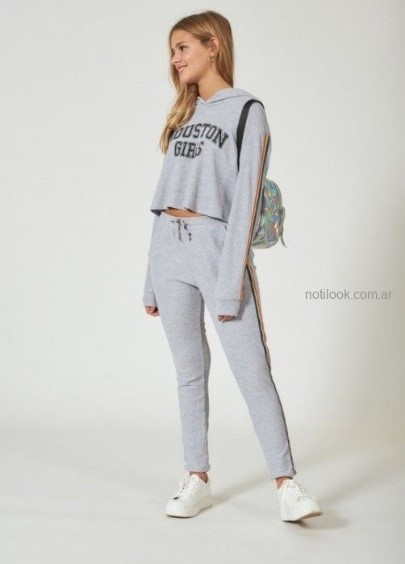
                    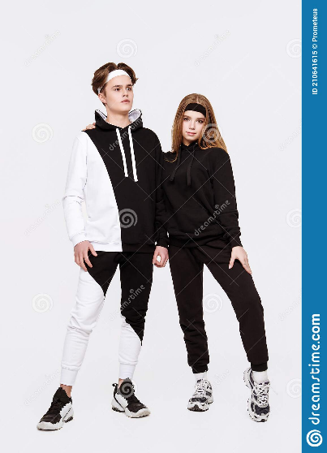
                    

                   

                      
                      
<strong>5. Fashion </strong> algo de moda

                      
también se le llama trendy. No es un estilo en sí mismo, sino que define una práctica: la de seguir siempre las tendencias en moda. Quienes se adhieren a él se ponen lo que se lleva, 
                        pero no se trata de asumir cualquier corriente sin criterio, sino de adaptarla a un estilo personal.

                      
<button class="w3-button w3-white w3-border" onclick="likeFunction(this)"><b><i class="fa fa-thumbs-up"></i> Like</b></button>

                      
<button class="w3-button w3-pink" onclick="myFunction('demo3')"><b>Replies  </b> 3</button>

                      

          
                      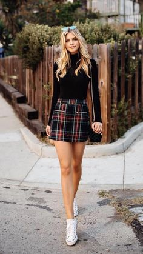
                      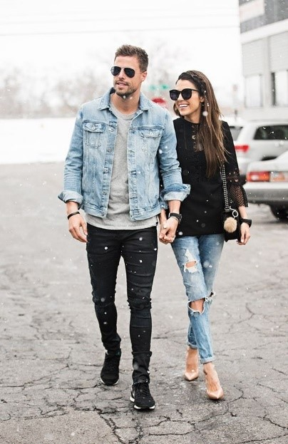
                      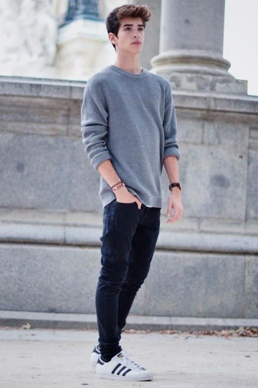
                      
          

          

            

              

                
              

              

                <h4>lisa May 3, 2006, 6:32 PM</h4>
                
la mejor moda

              

          

        

      

      

        

          
          
<strong>6. Hipster</strong> Un poco de la moda

          
Es el estilo de las mujeres inconformistas y que rehúsan encorsetarse. Por eso mezclan el grunge, 
            el boho y el hippie para configurar looks originales con algún toque gótico. Con criterio, eso sí, para no parecer un collage.

          
<button class="w3-button w3-white w3-border" onclick="likeFunction(this)"><b><i class="fa fa-thumbs-up"></i> Like</b></button>

          
<button class="w3-button w3-blue" onclick="myFunction('demo3')"><b>Replies  </b> 3</button>

          

          
          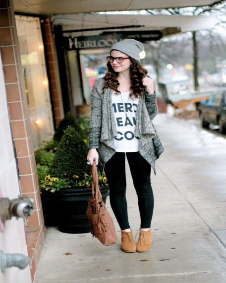
          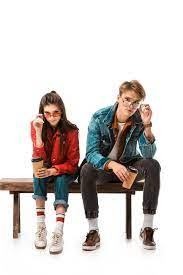
          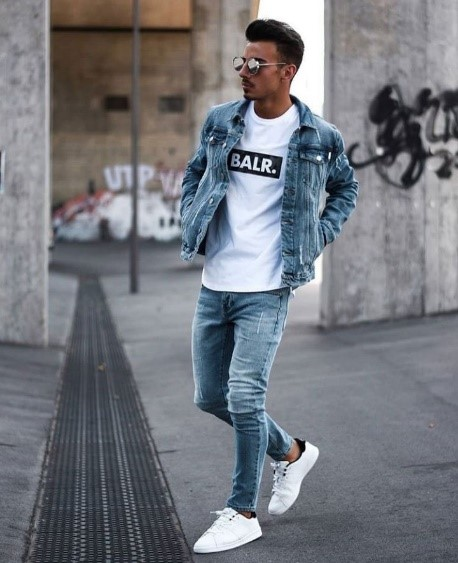
          
          

            
            
<strong>7. Grunge</strong> Un poco de la moda

            
el grunge es un estilo parecido al anterior, con la diferencia de que es más rígido. Nos referimos a que,
               si bien el hipster es más ecléctico y admite más mezcla, el grunge se ciñe a lo rebelde y desenfadado

            
<button class="w3-button w3-white w3-border" onclick="likeFunction(this)"><b><i class="fa fa-thumbs-up"></i> Like</b></button>

            
<button class="w3-button w3-red" onclick="myFunction('demo3')"><b>Replies  </b> 3</button>

            

            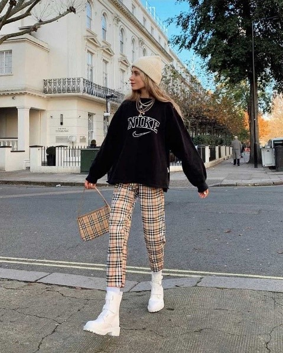
            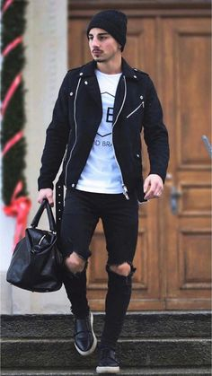

            

              
              
<strong>8. Minimalista</strong> Un poco de la moda

              
el minimalismo arrasa entre los estilos decorativos para el hogar y también en la moda. Se basa en la máxima de que menos es más, luego se ubica en una línea opuesta a la del estilo romántico, por ejemplo.
                 Es más parecido al clásico, con el que comparte ventajas como la atemporalidad

              
<button class="w3-button w3-white w3-border" onclick="likeFunction(this)"><b><i class="fa fa-thumbs-up"></i> Like</b></button>

              
<button class="w3-button w3-blue" onclick="myFunction('demo3')"><b>Replies  </b> 3</button>

              

              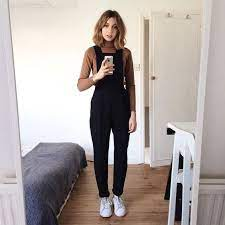
              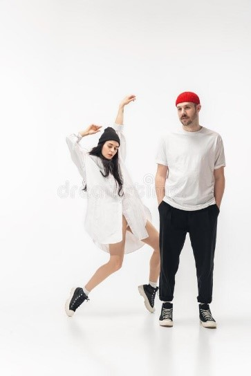
              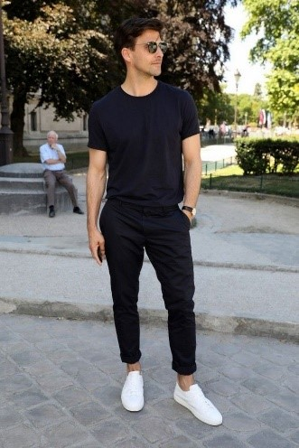

              

                
                
<strong>9. Preppy</strong> Un poco de la moda

                
Quizás el término se te asemeje a repipi, pero no. O sí, depende de cómo lo veas. Toma como referencia la forma de vestir de las estudiantes estadounidenses de clase alta, 
                  así que es uno de los estilos de moda femenina más juveniles. Y más posh

                
<button class="w3-button w3-white w3-border" onclick="likeFunction(this)"><b><i class="fa fa-thumbs-up"></i> Like</b></button>

                
<button class="w3-button w3-red" onclick="myFunction('demo3')"><b>Replies  </b> 3</button>

                

                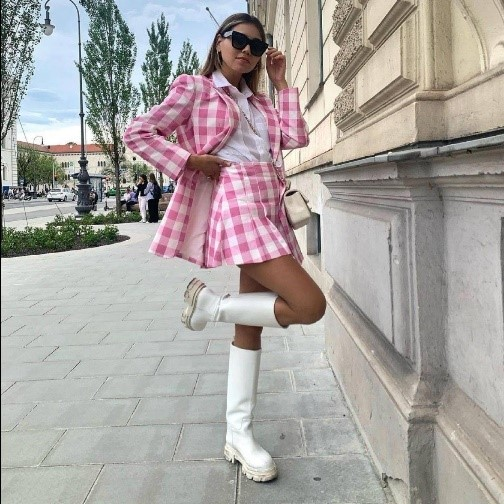
                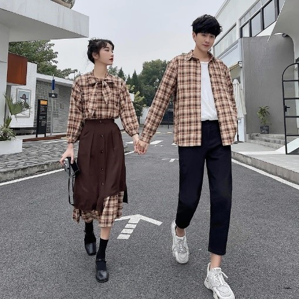
                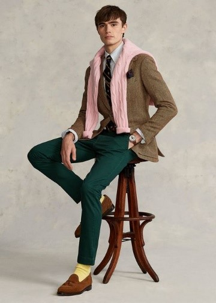
              
                

                  
                  
<strong>10. Urban-chic</strong> Un poco de la moda

                  
Se le llama también streetwear. Es un estilo libre, incluso diríamos que funciona a modo de cajón de sastre. Sigue las tendencias,
                     pero adaptándolas a las preferencias para ganar en comodidad y seguridad en una misma

                  
<button class="w3-button w3-white w3-border" onclick="likeFunction(this)"><b><i class="fa fa-thumbs-up"></i> Like</b></button>

                  
<button class="w3-button w3-blue" onclick="myFunction('demo3')"><b>Replies  </b> 3</button>

                  

                  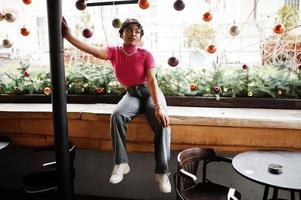
                  
          
                  

                    
                    
<strong>11. Emos</strong> Un poco de la moda

                    
Los Emos consta de prendas negras, pantalones, camisas y chaquetas ajustadas; los ojos maquillados, el mechón largo de cabello que les tapa medio rostro, 
                      a veces usan correas o cinturones con taches, y tienden a tener el aspecto de su piel muy blanco.

                    
<button class="w3-button w3-white w3-border" onclick="likeFunction(this)"><b><i class="fa fa-thumbs-up"></i> Like</b></button>

                    
<button class="w3-button w3-red" onclick="myFunction('demo3')"><b>Replies  </b> 3</button>

                    

                    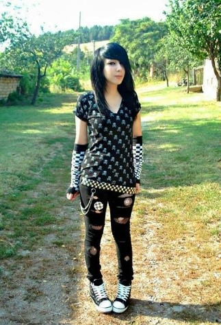
                    
                    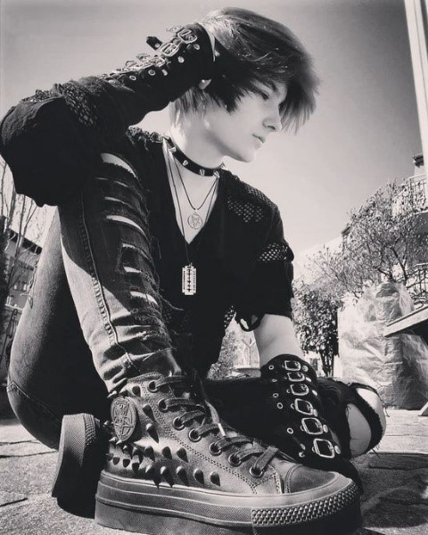
                    

                    

                      
                      
<strong>12. Dark</strong> Un poco de la moda

                      
El Dark es una forma de vida, expresada en la forma de vestir, en los gustos por la música y la literatura, 
                        temas recurrentes de la subcultura oscura como las novelas de terror, vampirismo

                      
<button class="w3-button w3-white w3-border" onclick="likeFunction(this)"><b><i class="fa fa-thumbs-up"></i> Like</b></button>

                      
<button class="w3-button w3-blue" onclick="myFunction('demo3')"><b>Replies  </b> 3</button>

                      

                      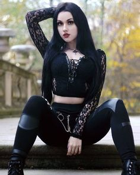
                      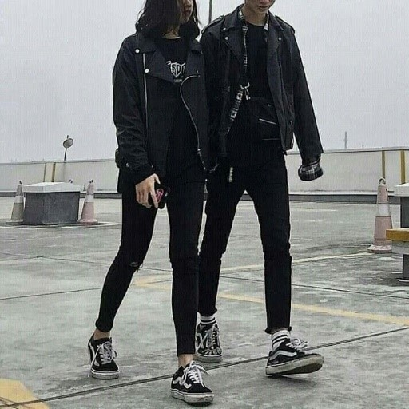
                      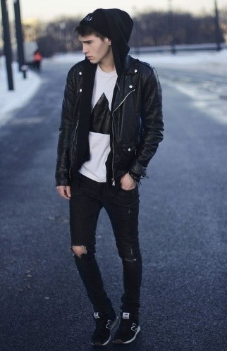

                      

                        
                        
<strong>13. cottagecore</strong> Un poco de la moda

                        
se refiere no sólo a una estética
                           y estilo de vestir sino a una forma de vida estrechamente vinculada al campo y a la vida rural

                        
<button class="w3-button w3-white w3-border" onclick="likeFunction(this)"><b><i class="fa fa-thumbs-up"></i> Like</b></button>

                        
<button class="w3-button w3-red" onclick="myFunction('demo3')"><b>Replies  </b> 3</button>

                        

                       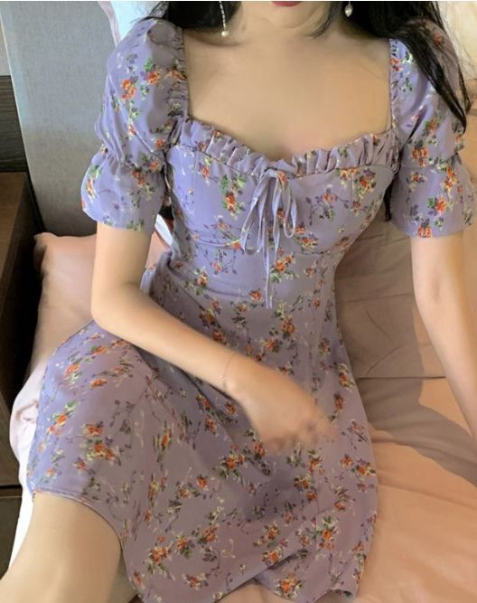
                       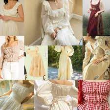
                       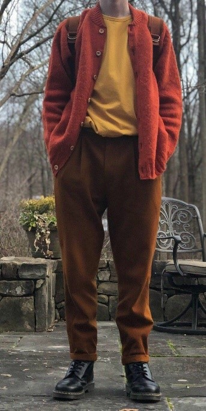

          <!-- Example of comment field -->
          

            

            

              

                
              

              

                <h4>maryApril 10, 2015, 7:22 PM</h4>
                
hermoso.

              

            

            

              

                
              

              

                <h4>brayanApril 8, 2015, 10:32 PM</h4>
                
lindos estilos.

              

            

            

              

                
              

              

                <h4>lindaApril 7, 2015, 9:12 PM</h4>
                
bellicimos!

              

            

          

        

      

      
    <!-- END BLOG ENTRIES -->
    

    <!-- About/Information menu -->
    

      <!-- About Card -->
      

        
        

          <h4>linda</h4>
          
lo mejor

        

      

      

      <!-- Posts -->
      

          <li class="w3-padding-16">
            
            Ana
             
            yo quiero esos stilos
          </li>
          <li class="w3-padding-16">
            
            lili
             
            donde los puedo conseguir 
          </li>
          <li class="w3-padding-16">
            
            jesika
             

          <h4>bellisimos</h4>
        

        

          

            Moda Hipster Grunge
            romántico Minimalista clasico
            Boho Preppy Emos
            Deportivo Urban-chic Dark
            fashion  cottagecore
          

        

      

      

      <!-- Inspiration -->
      

        

          <h4>Inspiration</h4>
        

        

          

            

            

          

          

            
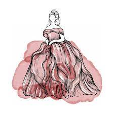

            
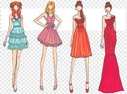

         

        

      

      

      

        

          <h4>Follow Me</h4>
        

        

          <i class="fa fa-facebook-official w3-hover-opacity"></i>
          <i class="fa fa-instagram w3-hover-opacity"></i>
          <i class="fa fa-snapchat w3-hover-opacity"></i>
          <i class="fa fa-pinterest-p w3-hover-opacity"></i>
          <i class="fa fa-twitter w3-hover-opacity"></i>
          <i class="fa fa-linkedin w3-hover-opacity"></i>
        

      

      

      
      <!-- Subscribe -->
      

        

          <h4>Subscribe</h4>
        

        

          
Enter your e-mail below and get notified on the latest blog posts.

          
<input class="w3-input w3-border" type="text" placeholder="Enter e-mail" style="width:100%">

          
<button type="button" onclick="document.getElementById('subscribe').style.display='block'" class="w3-button w3-block w3-red">Subscribe</button>

        

      

    <!-- END About/Intro Menu -->
    

  <!-- END GRID -->
  

<!-- END w3-content -->

<!-- Subscribe Modal -->

  

    

      <i onclick="document.getElementById('subscribe').style.display='none'" class="fa fa-remove w3-transparent w3-button w3-xlarge w3-right"></i>
      <h2 class="w3-wide">SUBSCRIBE</h2>
      
Join my mailing list to receive updates on the latest blog posts and other things.

      
<input class="w3-input w3-border" type="text" placeholder="Enter e-mail">

      <button type="button" class="w3-button w3-block w3-padding-large w3-red w3-margin-bottom" onclick="document.getElementById('subscribe').style.display='none'">Subscribe</button>
    

  

<!-- Footer -->
